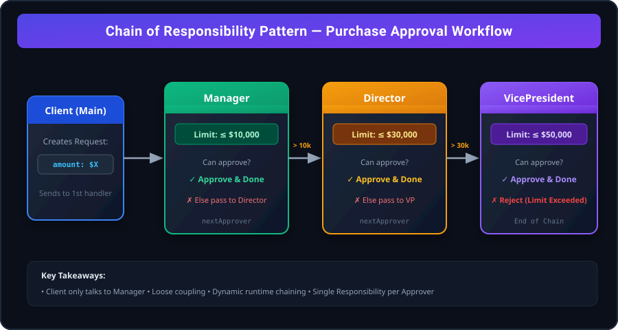
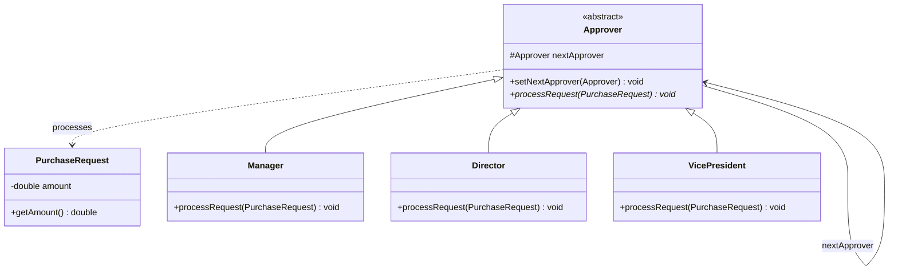
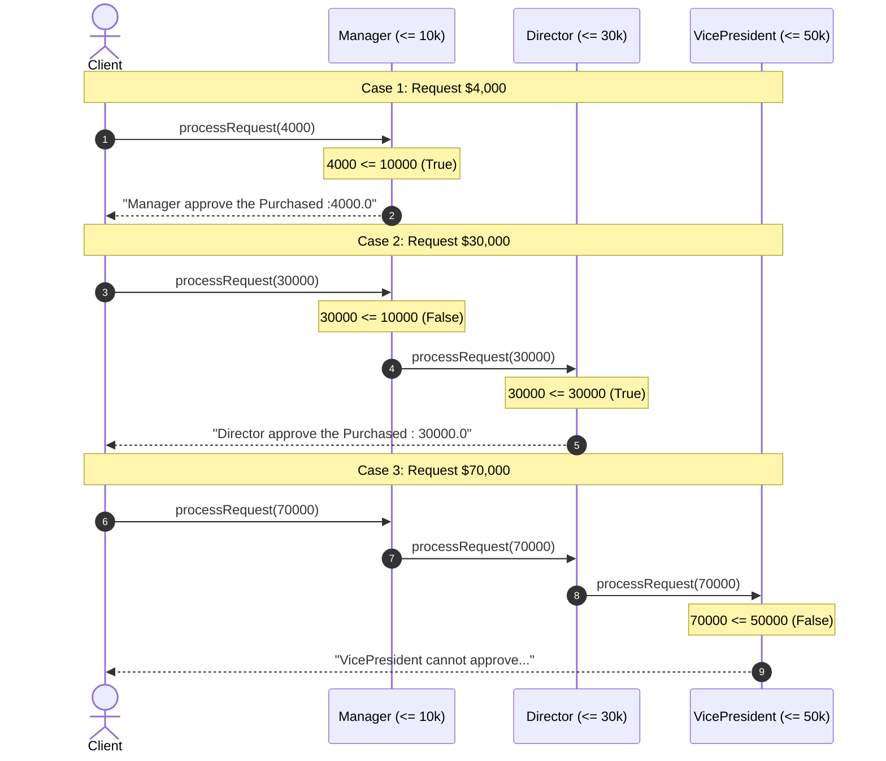
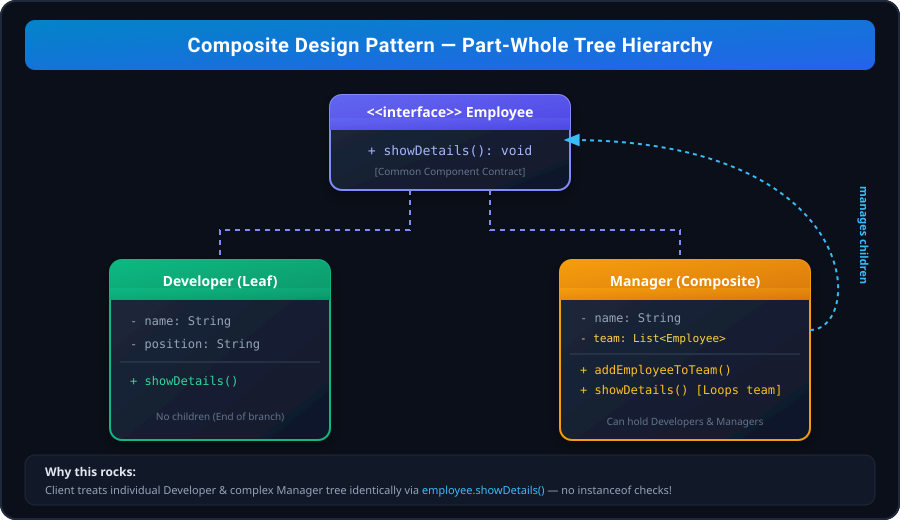
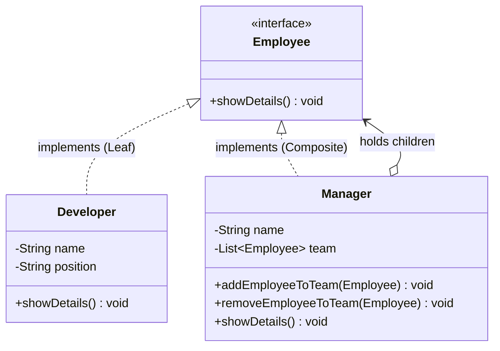

# Design Patterns Reference Guide: Chain of Responsibility & Composite

This guide provides an in-depth, English documentation of the **Chain of Responsibility** and **Composite** design patterns based on your Java implementations.

---

# 1. Chain of Responsibility Pattern

## 1.1 Intent & Overview
**Chain of Responsibility** is a **behavioral design pattern** that lets you pass requests along a chain of handlers. Upon receiving a request, each handler decides either to process the request or to pass it to the next handler in the chain.

---

## 1.2 The Problem It Solves
Imagine an approval process in an enterprise application:
- Small expenses can be approved by a **Manager**.
- Moderate expenses require a **Director**.
- Large expenses require a **Vice President**.
- Extremely large amounts cannot be approved and must be rejected.

### Without Chain of Responsibility:
If the client handles all decisions with a giant `if-else` or `switch` block:
- **Tight Coupling:** The client must know every single approver class, their hierarchy, and their internal business rules.
- **Violation of Open/Closed Principle (OCP):** Introducing a new approver (e.g., "Senior Manager") requires modifying the client code and altering tests.
- **Single Responsibility Principle (SRP) Violation:** One class becomes burdened with routing logic for every department.

### With Chain of Responsibility:
The client sends the request **only to the first handler**. The handlers form a linked chain. Each handler inspects the request:
- If capable $\rightarrow$ processes it and stops (or optionally forwards).
- If incapable $\rightarrow$ forwards it to `nextApprover`.

---

## 1.3 Structural Components





1. **Request Object (`PurchaseRequest`)**: Encapsulates the request details (e.g., amount).
2. **Handler Abstraction (`Approver`)**:
   - Holds a reference to the next handler (`nextApprover`).
   - Declares the uniform processing method (`processRequest`).
3. **Concrete Handlers (`Manager`, `Director`, `VicePresident`)**:
   - Contain the business logic to evaluate whether they can handle the request.
   - Delegate to `nextApprover` if the request exceeds their threshold.
4. **Client (`Main`)**:
   - Assembles the chain and triggers the first handler.

---

## 1.4 Code Walkthrough

### 1. The Request Model
```java
class PurchaseRequest {
    private double amount;

    PurchaseRequest(double amount) {
        this.amount = amount;
    }

    public double getAmount() {
        return amount;
    }
}
```

### 2. The Abstract Handler
```java
abstract class Approver {
    protected Approver nextApprover; // Reference to the successor

    public void setNextApprover(Approver nextApprover) {
        this.nextApprover = nextApprover;
    }

    public abstract void processRequest(PurchaseRequest request);
}
```

### 3. Concrete Handlers
```java
class Manager extends Approver {
    @Override
    public void processRequest(PurchaseRequest request) {
        if (request.getAmount() <= 10000) {
            System.out.println("Manager approve the Purchased :" + request.getAmount());
        } else if (nextApprover != null) {
            System.out.println("Manager cannot approve ,passing requests to  ");
            nextApprover.processRequest(request);
        } else {
            System.out.println("None of the approves can handle the request  ");
        }
    }
}

class Director extends Approver {
    @Override
    public void processRequest(PurchaseRequest request) {
        if (request.getAmount() <= 30000) {
            System.out.println("Director approve the Purchased : " + request.getAmount());
        } else if (nextApprover != null) {
            System.out.println("Director cannot approve ,passing requests to  ");
            nextApprover.processRequest(request);
        } else {
            System.out.println("None of the approves can handle the request  ");
        }
    }
}

class VicePresident extends Approver {
    @Override
    public void processRequest(PurchaseRequest request) {
        if (request.getAmount() <= 50000) {
            System.out.println("VicePresident approve the Purchased :" + request.getAmount());
        } else {
            System.out.println("VicePresident cannot approve ,passing requests to  ");
        }
    }
}
```

### 4. Client Assembly & Invocation
```java
public class Main {
    public static void main(String[] args) {
        Manager manager = new Manager();
        Director director = new Director();
        VicePresident vicePresident = new VicePresident();

        // Assemble the chain: Manager -> Director -> VicePresident
        manager.setNextApprover(director);
        director.setNextApprover(vicePresident);

        // Submit requests
        manager.processRequest(new PurchaseRequest(4000));
        manager.processRequest(new PurchaseRequest(30000));
        manager.processRequest(new PurchaseRequest(70000));
    }
}
```

---

## 1.5 Execution Trace (Dry Run)



---

## 1.6 Real-World Industry Examples
1. **Spring Security Filter Chain (`OncePerRequestFilter`, `SecurityFilterChain`)**:
   Incoming HTTP requests flow through `CorsFilter` $\rightarrow$ `CsrfFilter` $\rightarrow$ `JwtAuthenticationFilter` $\rightarrow$ `AuthorizationFilter`. If authentication fails, the filter short-circuits the response immediately.
2. **Java Servlet Filters (`javax.servlet.FilterChain`)**:
   Enables pre-processing and post-processing of web requests.
3. **Logging Systems (`java.util.logging`, Log4j)**:
   A log message traverses logger levels (`DEBUG` $\rightarrow$ `INFO` $\rightarrow$ `WARN` $\rightarrow$ `ERROR`).
4. **ATM Cash Dispenser**:
   A withdrawal of \$380 delegates: \$100 notes handler $\rightarrow$ \$50 notes handler $\rightarrow$ \$20 notes handler $\rightarrow$ \$10 notes handler.

---
---

# 2. Composite Design Pattern

## 2.1 Intent & Overview
**Composite** is a **structural design pattern** that lets you compose objects into tree-like structures to represent whole-part hierarchies. It allows clients to treat individual objects (**Leaves**) and compositions of objects (**Composites**) uniformly.

---

## 2.2 The Problem It Solves
Consider an organizational chart:
- An individual **Developer** is an employee.
- A **Manager** is an employee who also manages a team of other employees (which can include Developers or other Managers).

### Without Composite Pattern:
- You need separate classes and separate client methods for single contributors vs. managers.
- To display department details or calculate salary, the client must write nested loops and perform `instanceof` checks to see if an object is an individual or a container.

### With Composite Pattern:
- Both `Developer` (Leaf) and `Manager` (Composite) implement the same common interface (`Employee`).
- Calling `showDetails()` on a `Manager` prints their details and automatically recurses through all team members. The client treats individual objects and groups identically.

---

## 2.3 Structural Components





1. **Component Interface (`Employee`)**:
   - Defines the common interface for all elements in the tree (both leaves and containers).
2. **Leaf (`Developer`)**:
   - Basic building block with no children.
   - Executes the concrete operation directly.
3. **Composite (`Manager`)**:
   - Holds a collection of children (`List<Employee>`).
   - Delegates work recursively to its children when an operation is invoked.
4. **Client (`Main`)**:
   - Interacts with all elements via the `Employee` interface without needing to differentiate leaves from composites.

---

## 2.4 Code Walkthrough

### 1. Component Interface
```java
interface Employee {
    void showDetails();
}
```

### 2. Leaf Node (`Developer`)
```java
class Developer implements Employee {
    private String name;
    private String position;

    Developer(String name, String position) {
        this.name = name;
        this.position = position;
    }

    @Override
    public void showDetails() {
        System.out.println("Developer :" + name + "Position : " + position);
    }
}
```

### 3. Composite Node (`Manager`)
```java
class Manager implements Employee {
    private String name;
    List<Employee> team = new ArrayList<>(); // Can hold Developers or other Managers!

    Manager(String name) {
        this.name = name;
    }

    public void addEmployeeToTeam(Employee emp) {
        team.add(emp);
    }

    public void removeEmployeeToTeam(Employee emp) {
        team.remove(emp);
    }

    @Override
    public void showDetails() {
        System.out.println("Manager :" + name);
        System.out.println("Team : ");
        // Polymorphic recursion over all children
        for (Employee emp : team) {
            emp.showDetails();
        }
    }
}
```

### 4. Client Usage (`Main`)
```java
public class Main {
    public static void main(String[] args) {
        Developer dev1 = new Developer("Nitu", "MTS");
        Developer dev2 = new Developer("Priyes", "SDE-1");
        Developer dev3 = new Developer("Aashish", "AI AGENTIC");

        Manager manager = new Manager("Arjun");
        manager.addEmployeeToTeam(dev1);
        manager.addEmployeeToTeam(dev3);

        // One call renders the full tree
        manager.showDetails();
    }
}
```

---

## 2.5 Tree Structure Representation

```
                [Manager: Arjun]  (Composite)
                   /        \
                  /          \
   [Developer: Nitu]      [Developer: Aashish]
        (Leaf)                  (Leaf)
```
If `Arjun` manages another `Manager` named `Ravi`, `Ravi`'s team would automatically be printed recursively without any modification to client code!

---

## 2.6 Real-World Industry Examples
1. **File Systems**:
   - `File` is a **Leaf**.
   - `Directory` is a **Composite** containing `File`s and other `Directory` objects. Calling `getSize()` calculates size recursively.
2. **GUI Frameworks (Java Swing, Android View Hierarchy, React DOM)**:
   - `Button`, `TextView` are **Leaves**.
   - `ViewGroup`, `JPanel`, `CardView` are **Composites** holding child components. Calling `render()` or `draw()` renders the entire UI hierarchy.
3. **E-commerce Product Bundles**:
   - A single product (e.g., Keyboard) has a price.
   - A bundle (e.g., Gaming PC Bundle) contains multiple products and sub-bundles. Calling `getPrice()` totals all included items.

---
---

# 3. Direct Comparison: CoR vs. Composite

| Feature | Chain of Responsibility | Composite Pattern |
| :--- | :--- | :--- |
| **Category** | **Behavioral** (communication between objects) | **Structural** (composition of objects into hierarchies) |
| **Topology** | **Linear Chain / Linked List** (1-to-1 link) | **Tree Structure** (1-to-many children) |
| **Execution Flow** | Stops at the **first handler** that can satisfy the request | Broadcasts recursively to **all nodes** in the subtree |
| **Primary Goal** | Decouple the sender from potential receivers | Treat individual items and grouped items uniformly |
| **Node Types** | Successive handlers with similar roles | Leaves (terminals) and Composites (containers) |
